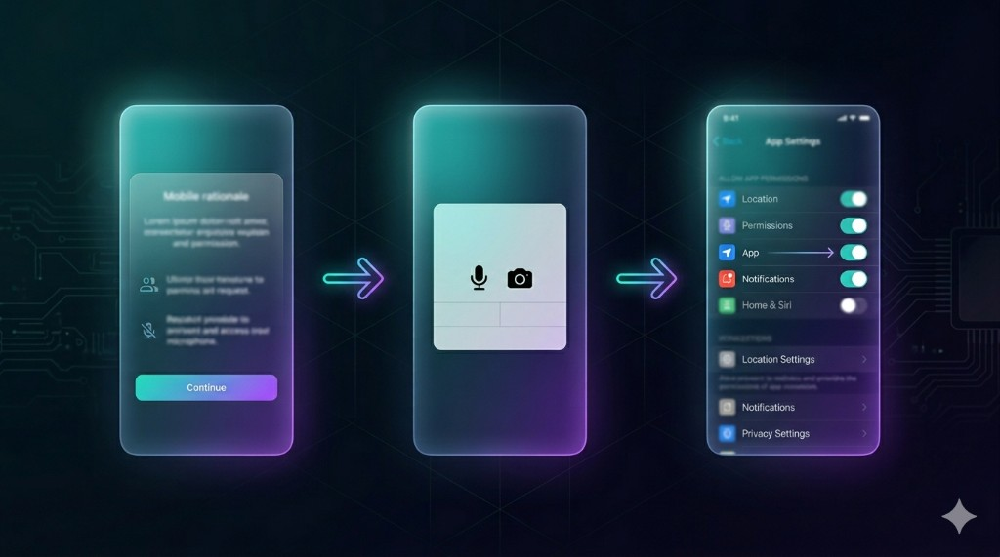

# flutter_permission_wizard

<p align="center">
  
</p>

A declarative, state-machine-driven permission flow for Flutter that fills the
gap between `permission_handler` (great OS API, zero UX) and what every
production app actually ships: a polished pre-prompt rationale, a clear
denied-state recovery flow, a Settings-app round-trip, and exhaustive
result handling.

Everything is fully themeable, fully testable, and ships as a pure Dart
package — no extra native code, no plugin registration steps.

---

## Why this exists

`permission_handler` answers one question: *what does the OS say about this
permission right now?* Every team then rebuilds the same things on top:

- A rationale dialog explaining *why* you need the permission.
- A "you denied it; here's how to fix it" screen.
- A round-trip to the Settings app with a status re-check on resume.
- Platform-specific quirks: iOS-first-denial-is-permanent, Android-
  shouldShowRequestPermissionRationale, Android-13 split storage perms,
  iOS Photos limited grants, …

`flutter_permission_wizard` ships all of this as a single, themed
state-machine you configure declaratively and hand control to:

```dart
final result = await PermissionWizard.request(
  context: context,
  request: PermissionRequest(
    permission: Permission.camera,
    rationale: PermissionRationale(
      iconData: Icons.camera_alt_rounded,
      title: 'Camera Access',
      description: 'Used to scan QR codes and take profile photos.',
      allowButtonText: 'Allow Camera',
      denyButtonText: 'Not Now',
    ),
    deniedConfig: PermissionDeniedConfig(
      title: 'Camera is off',
      description: 'Turn on camera access in settings to continue.',
      openSettingsText: 'Open Settings',
      skipText: 'Skip for now',
    ),
  ),
);

switch (result) {
  case GrantedResult():    launchCamera();
  case LimitedResult():    launchCamera();         // iOS Photos
  case DeniedResult():     showDegradedMode();
  case RestrictedResult(): showRestrictedMessage();
  case CancelledResult():  break;
}
```

---

## Installation

```yaml
dependencies:
  flutter_permission_wizard: ^0.1.0
```

The package brings in `permission_handler` and `app_settings` transitively;
follow each plugin's platform-setup guide (Info.plist usage descriptions,
Android manifest entries) per the permission you intend to request.

---

## The state machine

Every wizard run drives this finite-state machine:

```
IDLE
  └─▶ CHECKING_STATUS
        ├─▶ GRANTED           (already granted → call onGranted, done)
        ├─▶ RESTRICTED        (MDM/parental → show restricted screen, done)
        └─▶ NEEDS_REQUEST
              └─▶ SHOWING_RATIONALE        (if rationale configured)
                    ├─▶ CANCELLED          (user tapped "Not Now")
                    └─▶ REQUESTING_OS
              └─▶ REQUESTING_OS            (skip rationale if not configured)
                    ├─▶ GRANTED            (OS granted → done)
                    ├─▶ DENIED_SOFT        (Android first-time denial)
                    │     ├─▶ SHOWING_RATIONALE  (user tapped "Try Again")
                    │     └─▶ CANCELLED          (user tapped "Skip")
                    └─▶ DENIED_PERMANENT
                          ├─▶ OPENING_SETTINGS
                          │     └─▶ AWAITING_RESUME
                          │           └─▶ CHECKING_STATUS  (on app foreground)
                          └─▶ CANCELLED          (user tapped "Skip")
```

You can introspect or unit-test the FSM directly through
`PermissionStateMachine`.

---

## Three ways to use it

### 1. Static imperative API

For one-shot requests at a specific moment in code (button tap, navigation
event, etc).

```dart
final result = await PermissionWizard.request(
  context: context,
  request: PermissionRequest(
    permission: Permission.microphone,
    rationale: PermissionRationale(
      title: 'Microphone access',
      description: 'So we can record your voice messages.',
      allowButtonText: 'Allow',
      denyButtonText: 'Not Now',
      style: RationaleStyle.bottomSheet,
    ),
  ),
);
```

### 2. Reactive builder widget

For screens where the rendered UI depends on the current permission state
and you want it to rebuild automatically.

```dart
PermissionWizardBuilder(
  request: PermissionRequest(
    permission: Permission.locationWhenInUse,
    rationale: PermissionRationale(
      title: 'Location for Nearby Results',
      description: 'We use your location to show restaurants near you.',
    ),
  ),
  builder: (context, status, requestPermission) {
    return switch (status) {
      WizardStatus.granted    => const MapWidget(),
      WizardStatus.denied     => TextButton(
        onPressed: requestPermission,
        child: const Text('Enable Location'),
      ),
      WizardStatus.restricted => const RestrictedPlaceholder(),
      _                       => const SizedBox.shrink(),
    };
  },
)
```

### 3. Controller-driven flow

When you need to trigger a wizard from outside the widget tree (BLoC,
ViewModel, etc.) or coordinate multiple permissions yourself.

```dart
final controller = PermissionWizardController(
  request: PermissionRequest(permission: Permission.microphone, /* ... */),
);

controller.stream.listen((status) => debugPrint('mic status = $status'));

await controller.requestPermission(context);
if (controller.isGranted) { /* … */ }
```

---

## Batch requests

Request several permissions in one flow. Two strategies:

- `BatchStrategy.combined` — show one shared rationale, then run OS prompts
  sequentially. Best for "video call needs camera **and** microphone".
- `BatchStrategy.sequential` — run a full wizard per permission. Best when
  permissions are optional and unrelated.

```dart
final result = await PermissionWizard.requestBatch(
  context: context,
  request: BatchPermissionRequest(
    strategy: BatchStrategy.combined,
    batchRationale: PermissionRationale(
      title: 'Video Calling Needs Two Things',
      description: 'Camera for video, microphone for audio.',
      bullets: [
        PermissionBullet(icon: Icons.camera_alt, label: 'Camera'),
        PermissionBullet(icon: Icons.mic,         label: 'Microphone'),
      ],
      allowButtonText: 'Allow Both',
    ),
    permissions: [
      PermissionRequest(permission: Permission.camera),
      PermissionRequest(permission: Permission.microphone),
    ],
  ),
);

if (result.allGranted) startVideoCall();
```

`BatchPermissionWizardResult` exposes per-permission results plus
`allGranted`, `anyGranted`, `grantedPermissions`, `deniedPermissions`.

---

## Theming

Every UI surface listens to the ambient `ThemeData` (light/dark/M3) so it
"just works" out of the box. Override anything via `WizardTheme`:

```dart
PermissionRequest(
  permission: Permission.camera,
  theme: WizardTheme(
    primaryColor: Colors.deepPurple,
    iconBackgroundColor: Colors.deepPurple.shade50,
    primaryButtonStyle: FilledButton.styleFrom(
      backgroundColor: Colors.deepPurple,
      shape: const StadiumBorder(),
    ),
  ),
  ...
);
```

For truly custom UIs use the `customBuilder` escape hatch on either
`PermissionRationale` or `PermissionDeniedConfig` — you'll be handed
callbacks for every action and render whatever widget you want.

---

## Presentation styles

`PermissionRationale.style` and `PermissionDeniedConfig.style` switch
between three layouts without any other code changes:

| Style                       | Use it when                                                |
| --------------------------- | ---------------------------------------------------------- |
| `RationaleStyle.dialog`     | Default — centered modal `AlertDialog`.                    |
| `RationaleStyle.bottomSheet`| You want a slide-up sheet, e.g. on a content-heavy screen. |
| `RationaleStyle.fullScreen` | Onboarding-style flows where the rationale gets a screen.  |
| `DeniedStyle.dialog`        | Quick recovery from soft denial.                           |
| `DeniedStyle.bottomSheet`   | Less interruptive recovery prompt.                         |
| `DeniedStyle.fullScreen`    | When the permission gates a primary feature.               |

---

## Platform differences (handled for you)

The package abstracts the platform via `PlatformPermissionChecker`. Two
concrete implementations ship out of the box, picked automatically.

### iOS

- First denial is *permanent* — there is no soft-denial concept. The
  package stores a per-permission "has been asked" flag in memory (use a
  custom `WizardPreferencesStorage` if you need persistence across
  cold starts) and surfaces denials as permanent for any second-or-later
  attempt.
- `PermissionStatus.limited` (iOS 14+ Photos) becomes `LimitedResult` so
  you can offer a "Select more photos" action without branching on the
  raw `PermissionStatus` enum.
- `PermissionStatus.provisional` (iOS 12+ Notifications) is treated as
  granted.

### Android

- `shouldShowRequestPermissionRationale` disambiguates soft denial from
  "don't ask again" so the package can show the correct UI.
- Android 13+ image/audio split — `Permission.photos`, `Permission.videos`,
  `Permission.audio` — is **not** auto-translated. Pass the permission your
  app's `targetSdkVersion` expects.
- Android 12+ `Permission.locationAlways` requires showing
  `locationWhenInUse` first; `permission_handler` chains this transparently.

---

## Edge cases (all handled)

| Scenario                                            | Behaviour                                                       |
| --------------------------------------------------- | --------------------------------------------------------------- |
| Permission already granted                          | Returns `GrantedResult` immediately, no UI shown.               |
| Concurrent `PermissionWizard.request()` calls       | Queued internally — at most one wizard visible at a time.       |
| App backgrounded mid-flow                           | Current dialog is dismissed, returns `CancelledResult(app_backgrounded)`. |
| User returns from Settings unchanged                | Re-shows the denied screen with the *Open Settings* button suppressed (only Skip remains). |
| Max-retry budget exhausted                          | Returns `CancelledResult(max_retries_exceeded)`.                |
| iOS notification permission                         | Routed through `permission_handler`'s notification API. The wizard treats `provisional` as granted. |
| Dark mode                                           | Every component inherits from `Theme.of(context)`.              |
| Disposed `BuildContext` between async gaps          | Wizard short-circuits with `CancelledResult(app_backgrounded)`. |

---

## Observing the flow

All side-effect-free hooks live on `PermissionWizardCallbacks`. None of
them affect the result.

```dart
PermissionRequest(
  /* ... */
  callbacks: PermissionWizardCallbacks(
    onRationaleShown:     () => analytics.track('rationale_shown'),
    onRationaleAccepted:  () => analytics.track('rationale_accepted'),
    onRationaleDismissed: () => analytics.track('rationale_dismissed'),
    onOSDialogPresented:  () => analytics.track('os_dialog'),
    onGranted:            () => analytics.track('granted'),
    onDenied: (isPermanent) =>
        analytics.track(isPermanent ? 'denied_permanent' : 'denied_soft'),
    onSettingsOpened: () => analytics.track('settings_opened'),
    onReturnedFromSettings: (status) =>
        analytics.track('returned_from_settings', {'status': status.name}),
    onCancelled: (reason) =>
        analytics.track('cancelled', {'reason': reason}),
  ),
);
```

Cancel reasons (`WizardCancelReason`):
`rationale_dismissed`, `soft_denied_skipped`, `permanent_denied_skipped`,
`max_retries_exceeded`, `app_backgrounded`, `restricted_dismissed`.

---

## Testing

The package is fully testable without a real device:

- The state machine (`PermissionStateMachine`) is pure Dart — feed it
  `WizardEvent`s and assert on the resulting `WizardPhase`.
- Inject a custom `PlatformPermissionChecker` via
  `PermissionWizard.debugConfigure(checker: …)` to script any sequence of
  `PermissionStatus` and `RequestOutcome` values.
- A `FakeSettingsLauncher` is provided for simulating the Settings
  round-trip.
- `AppLifecycleObserver.emit(...)` (visible-for-testing) lets you simulate
  background/resume events.

Example:

```dart
PermissionWizard.debugConfigure(
  checker: FakeChecker(
    statusScript: [PermissionStatus.denied],
    requestScript: [RequestOutcome.granted],
  ),
  settingsLauncher: FakeSettingsLauncher(),
);
```

See `test/` for ~70 unit, widget, and golden tests covering every
documented edge case.

---

## License

MIT. See `LICENSE`.
